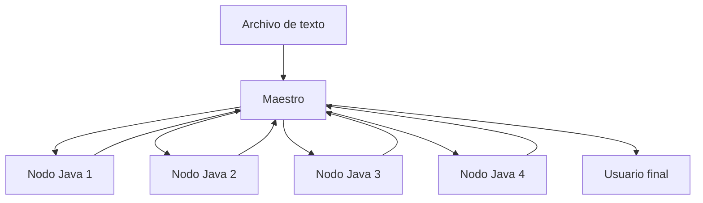

# Proyecto: Contador de Palabras Distribuido

Este proyecto implementa un sistema distribuido usando **ZeroC ICE**, donde:
- Un nodo maestro en **Python** distribuye el trabajo.
- Múltiples nodos trabajadores en **Java** procesan archivos de texto.
- Los resultados se combinan para obtener estadísticas globales como el conteo de palabras y contexto.

## Estructura del Repositorio

- `maestro`: Nodo maestro que coordina los procesos (Python + Flask).
- `nodo_java`: Nodo(s) trabajador(es) en Java.
- `shared`: Archivos `.ice` compartidos que definen las interfaces ICE.
- `texts`: Archivos de texto para análisis.
- `referencias`: Resultados opcionales con contexto.

## Arquitectura del Sistema



## Cómo Funciona

1. El usuario sube un archivo `.txt` y define palabras a buscar.
2. El nodo maestro divide el archivo en partes iguales.
3. Cada chunk se envía por red a un nodo trabajador vía ICE.
4. Cada nodo analiza su parte (conteo y contexto si se desea).
5. El maestro junta los resultados y los muestra en la web.

## Tecnologías
- **ZeroC ICE**: Framework de comunicación RPC distribuido.
- **Python + Flask**: Frontend simple para interacción web.
- **Java**: Nodos trabajadores concurrentes.
- **Docker + Docker Compose**: Orquestación y aislamiento de cada servicio.
- **Weave Scope**: Visualización de contenedores y red.

## Uso
```bash
docker-compose up --build
```

Luego, abre `http://localhost` en tu navegador y carga un archivo `.txt`.

## Autor
Sebastián Puentes — 2025

